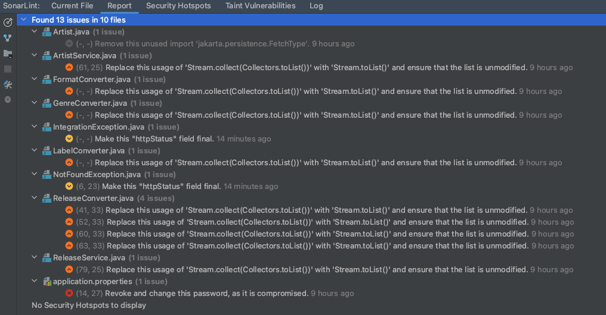

## Artists Challenge

## Notes
- Prerequisites: Maven and Java 21.
- The port to be used is 8082.
- To generate the challenge jar, execute the following Maven command at project's root folder (/artist-challenge/).
  > mvn clean install
- To execute the challenge jar, which will be generated at the target folder (/artist-challenge/target/), the following command can be used.
  > java -jar artist-challenge-0.0.1-SNAPSHOT.jar
- Unitary Tests were developed with JUnit and Mockito for ReleaseService, with 100% coverage. This with the idea of demonstrating the knowledge in testing.

## Endpoints
- GET /api/artist/{artistName}/releases
  - This endpoint returns a list of the releases of an artist specified by name. It stores in database the data retrieved from Discogs API.
  - Parameter (Path Variable)
    - artistName (String)
  - Response codes:
    - HTTP 200 OK: The request was successful and returns the artist's releases.
    - HTTP 404 Not Found: The artist has no release records in Discogs API.
- POST /api/artists/compare
  - This endpoint allows you to compare several artists based on a set of specified criteria. A list of artist names is sent to get comparison information about them.
  - Parameters (Request Body)
    - criteria (String): The criteria used to make the comparison. Possible values: releaseCount, activeYears, genresCount.
    - artistNames (List<String>): A list of names of artists to be compared.
    - Successful Response (200 OK): Returns a list of objects containing the comparison information of the requested artists.

## Code analysis using the IntelliJ IDEA SonarLint Plugin:
